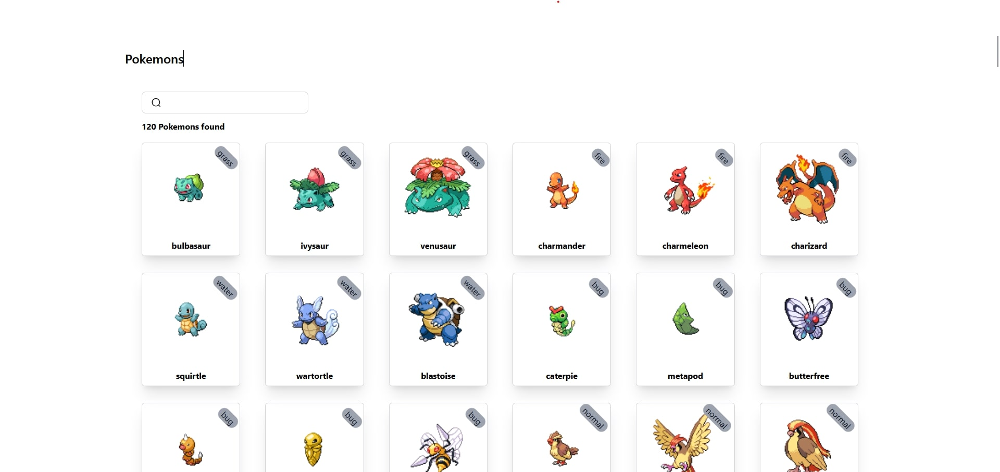

# [Pokemon Sansaar](https://pokemon-sansaar.netlify.app/). Search your favorite pokemon

### Installation

**1. Clone the repository**

**2. Install Dependencies**

**npm**

```sh
npm install
 ```

**3. Run development server**

```sh
npm run dev
 ```

**OR**

**3. Run Production server**

```sh
npm run preview
 ```

## Preview

[](https://pokemon-sansaar.netlify.app/)

## 🚀 Project Structure

Inside of project sansaar, you'll see the following folders and files:

```text
/
├── public/
│   └── favicon.svg
├── src/
│   ├── components/
│   │   └── Card.astro
│   ├── layouts/
│   │   └── Layout.astro
|   ├── pages/
│   │   └── index.astro
│   └── hooks/
│       └── hooks.tsx
└── package.json
```

## 🧞 Commands

All commands are run from the root of the project, from a terminal:

| Command                   | Action                                           |
| :------------------------ | :----------------------------------------------- |
| `npm install`             | Installs dependencies                            |
| `npm run dev`             | Starts local dev server at `localhost:4321`      |
| `npm run build`           | Build your production site to `./dist/`          |
| `npm run preview`         | Preview your build locally, before deploying     |
| `npm run astro ...`       | Run CLI commands like `astro add`, `astro check` |
| `npm run astro -- --help` | Get help using the Astro CLI                     |
